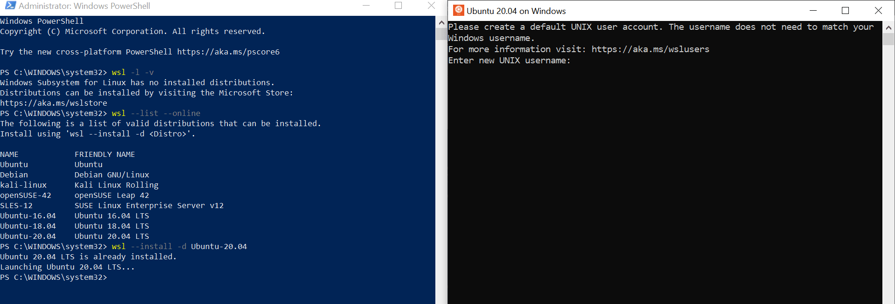
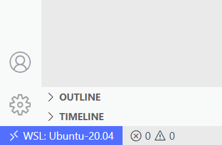

## Walkthrough: how to install WSL and Visual Studio Code on Windows

1. **Install WSL**:
	1. press **`Win Key` +` R`**
	2. type in `powershell` in a pop up window and press **Ctrl+Shift+Enter** or press and hold **`Ctrl` + `Shift`** and click **OK** to make PowerShell run as administrator
	4. to get the exact name for the installed distros, run `wsl -l -v`
	6. [download](https://wslstorestorage.blob.core.windows.net/wslblob/wsl_update_x64.msi) and install the WSL2 Linux kernel update package for x64 machines. To check your machine's CPU, run `systeminfo | find "System Type"` in PowerShell
	7. to set the default version of WSL to WSL 2, run `wsl --set-default-version 2`
	8. if need to delete the any distro, run  `wsl --unregister <DistributionName>`
	9. run `wsl --list --online`  or  `wsl -l -o` to see a list of distros available for installation.
	10. run `wsl --install -d <DistributionName>`  to install a required distro, i.e., `wsl --install -d Ubuntu-20.04`
	11. if needed to change wsl version `wsl -s <DistributionName>`  or  `wsl --setdefault <DistributionName>`
	12. enter a user name and password
	
	
	
	14. to reset password:
		1. check the distro app name:
			* for **Ubuntu**, use `ubuntu`
			* for **Ubuntu 20.04**, use `ubuntu2004`
			* for **Ubuntu 18.04**, use `ubuntu1804`
			* for **Debian**, use `debian`
			* for **Kali Linux**, use `kali`
		2. to set root as a default user, run `ubuntu2004 config --default-user root` in PowerShell
		3. check the username by running `ls /home` in WSL
		4. create a new password for user `passwd <UserName>`
		5. to set default user, run `ubuntu config --default-user <UserName>` in PowerShell
		6. to shut down distro, run `wsl -t <DistributionName>` 
		
2. **Update WSL packages**:
	1. to update repositories, run `sudo apt update`
	2. to check upgradable packages, run `apt list --upgradable`
	3. to update all packages, run `sudo apt upgrade -y`
	4. or run a one-liner `sudo apt update && sudo apt upgrade -y`
	
3. **Install Python**:
	1. to improve apt download time, run `sudo add-apt-repository -y ppa:apt-fast/stable && sudo apt-get update && sudo apt-get -y install apt-fast aria2`. Check [documentation](https://github.com/ilikenwf/apt-fast) for more details
	2. to install Python, run `sudo apt-fast install -y python3.9 python3-pip ipython3`

4. **Install mamba**:
	1. to download Miniconda, run `cd ~ && aria2c https://repo.anaconda.com/miniconda/Miniconda3-py39_4.11.0-Linux-x86_64.sh`
	2. to check hash, run `sha256sum Miniconda3-py39_4.11.0-Linux-x86_64.sh`, it should report [**4ee9c3aa53329cd7a63b49877c0babb49b19b7e5af29807b793a76bdb1d362b4**](https://docs.conda.io/en/latest/miniconda.html)
	3. to install Miniconda, run `bash Miniconda3-py39_4.11.0-Linux-x86_64.sh`
	4. to install mamba, run `conda install -y mamba -n base -c conda-forge`
	5. to activate mamba, run `mamba init` and open a new terminal
	6. to install mamba autocompletion, run `mamba install -y -c conda-forge mamba-bash-completion` and open a new terminal
	7. to create environment, run `mamba create -y -n <MyEnv> python=3.9`
	8. to activate environment, run `mamba activate <MyEnv>`
	9. to install packages, run `mamba install -y numba numpy pandas ipython scikit-learn jupyter scipy matplotlib seaborn statsmodels openpyxl tensorflow`
	10. `mamba install -y scikit-learn-intelex`. Basic use `from sklearnex import patch_sklearn; patch_sklearn()`, [check documentation](https://intel.github.io/scikit-learn-intelex) for more details
	11. to install additional packages, run`mamba install -y -c conda-forge umap-learn sktime-all-extras pybedtools pywavelets lz4`

5. **Install Visual Studio Code**:
	1. [download](https://code.visualstudio.com/sha/download?build=stable&os=win32-x64-user) and install Visual Studio Code for Windows. When prompted to Select Additional Tasks during installation, be sure to check the **Add to PATH** option.
	2. to open a  WSL terminal window, run `wsl` in PowerShell
	3. to navigate to a user's home folder, run `cd home/<UserName>`
	4. to view the current directory in Windows File Explorer, run `exporer.exe .`
	5. to initiate Visual Code, run `code .` in the terminal. Once finished, you now see a WSL indicator in the bottom left corner
	
	
	
	7. to create new terminal, press **`Ctrl` + `Shift` + `` ` ``**
	8. to provide user with sufficient permissions to write to files, run `sudo find /home/ -type d -user root -exec sudo chown -R $USER: {}  \;`
	9. Use VS Code normally
